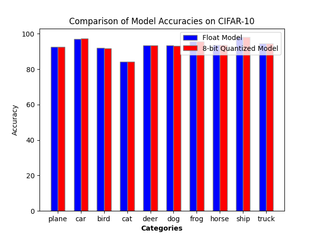

# vgg-quantization-benchmark
A benchmark for vgg and its quantization.

## Install and run

1. Finetune the Vgg on the Fash-Mnist for ten epoches,
becase the Vgg is trained on the ImageNet, which is a large dataset. 
The dataset and the original model will be downloaded automatically.
You need a `VPN` to download the dataset and the model if you are in China.
It takes about 2 hours on `RTX3070Ti` to finetune the model.


```bash
python3 train.py
```

~~2. Quantize the finetuned model with 8 bits...(Too complicated here , I do it for you, 
his method is too complicated.)~~


3. Run benchmark on the both finetuned model and quantized model.

```bash
  python benchmark.py
```

- Float Version  :
  - 520M
  - 32bit
  - runing at RTX3070Ti
> - Time cost on the float model: 42 seconds on GPU
> - Time cost on the float model: 840.63 seconds on CPU

> Accuracy of the float model on the 10000 CIFAR-10 test images: 93.48%

- Quant Verison :
  - 170M
  - 8bit
  - runing at i9-12900H
> Accuracy of the network on the 10000 test images: 93 %

>- Time taken: 1031 seconds on CPU  about times faster 
> - GPU test is unavailable.


## Benchmark visualization


